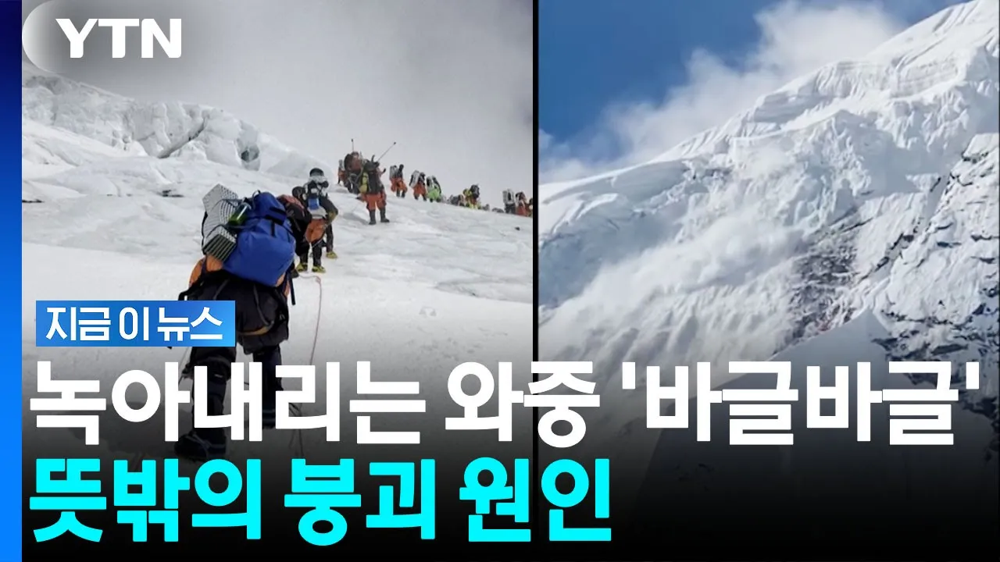

# "하루 소변만 6000ℓ"…에베레스트 빙하 녹인 뜻밖의 범인 [지금이뉴스] / YTN

## 기본 정보
- **URL**: https://www.youtube.com/watch?v=7Sihcb5MAcA
- **채널명**:  YTN
- **구독자수**: 541만
- **조회수**: 14,884
- **업로드일**: 2026-08-31
- **영상 길이**: 2:57
- **댓글 수**: 12
- **좋아요 수**: 55

## 썸네일

---

## 댓글 (추천순 TOP 10)

| 순위 | 좋아요 | 댓글 |
|------|--------|------|
| 1 | 7 | 국내 산불의 원인 상당수가 등산객의 담배 꽁초 혹은 불법 취사.. |
| 2 | 4 | 등반관광 안가면 네팔은 뭐 먹고사나요 이제 가라고 해도 겁나서 가것나요 안타까운 일입니다 삼가고인에 명복을빕니다 |
| 3 | 2 | 사람들이 드글드글 기어올라가서 배변을 하니 에베레스트 산 입장에서는 인간들은 사람들이 생각하는 머릿니하고 같은격일듯하네요. 머릿니는 없애야 하니.... ㅋ. |
| 4 | 0 | 목숨 걸고 고봉 등정하려던 것도 아니었는데 몇초만에~ 트래킹 도중 진흙에 휩쓸려 영원히 못찾으면 인류는 멸망하고 3천만년 뒤 쯤 지구를 차지한 어느 종에게 화석으로 발견될 수 있다는 것? 이 게 지금 말이 되는겨? |
| 5 | 10 | 이제는 에베레스트는 등반금지시키야됨 |
| 6 | 2 | 예전에 이런말이 있었지.. 중국은 전쟁할 필요가없다.. 중국이 마음만 먹으면 중국인구 전체가 바닷가로 나와서 오줌만싸도 대부분에 국가는 잠긴다고 |
| 7 | 0 | ㅋㅋㅋㅋㅋㅋㅋㅋㅋㅋㅋ |
| 8 | 0 | 인도 인구가 더 많음 |
| 9 | 0 | 네팔인들도 이번 재앙과 전혀 무관하진 않죠~ 베이스 캠프에서 빵까지 만들어 고가에 판매합니다 ㅋㅋ |
| 10 | 3 | 인간들땜에  지구종말이 앞당겨지고있다. |
