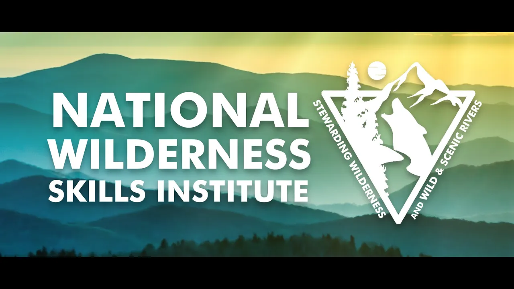

# NWSI 2025 New Research-Based Methods for Managing Poop in the Backcountry

## 기본 정보
- **URL**: https://www.youtube.com/watch?v=ST8dedHbSs4
- **채널명**: Society for Wilderness Stewardship
- **구독자수**: 271
- **조회수**: 89
- **업로드일**: 2025-07-17
- **영상 길이**: 24:43
- **댓글 수**: None
- **좋아요 수**: 3

## 썸네일

---

## 댓글 (추천순 TOP 10)

| 순위 | 좋아요 | 댓글 |
|------|--------|------|
