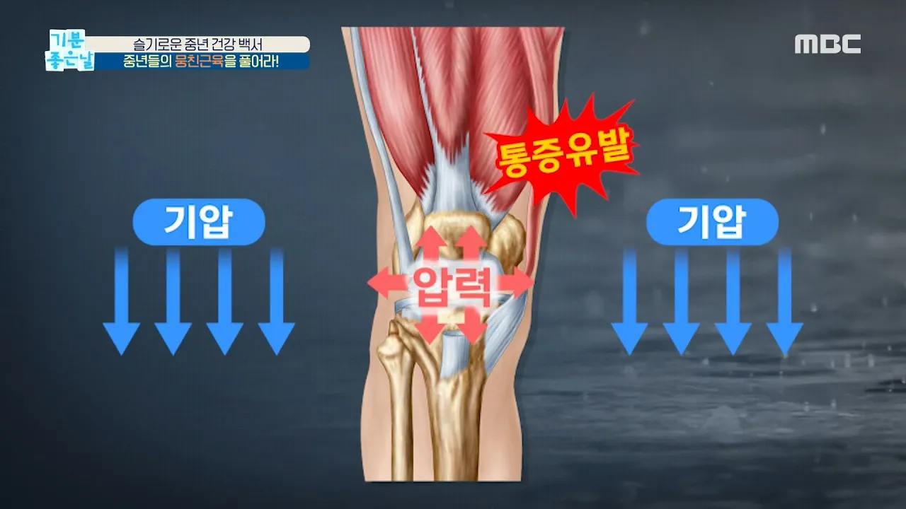

# [기분 좋은 날] 비가 오면 유독 관절·근육이 아픈 이유는? MBC 200911 방송

## 기본 정보
- **URL**: https://www.youtube.com/watch?v=WdS3Zb1hpBo
- **채널명**: MBClife
- **구독자수**: 69만
- **조회수**: 7,246
- **업로드일**: 2020-09-11
- **영상 길이**: 2:09
- **댓글 수**: 3
- **좋아요 수**: 41

## 썸네일

---

## 댓글 (추천순 TOP 10)

| 순위 | 좋아요 | 댓글 |
|------|--------|------|
| 1 | 21 | 비오면 무릎이 유독 쑤시는데 진짜 고통이에요. 원적열 찜질 20분 정도 하면서 관리하니까 확실히 덜 아픈데 스트레칭이랑 같이 병행해서 해봐야겠어요. |
| 2 | 6 | 비 오면. 무릎 내 압력이. 높아져서. 다들 고생이시죠  무릎 염증이. 심할수록 더 그렇대요. 브로콜리, 강황, 시금치 염증에. 좋아요 .
 통증 기능성 콘타큐 성분 + 무릎 보호대 + 냉찜질 + 채식 + 꾸준한 물리치료 .
 이렇게. 생활습관. 잘 잡고 가면 염증. 많이 완화되서 일상 통증. 많이 줄일 수. 있어요.
 지인. 정형외과 의사쌤과. 병원 발품팔면서 몇년해보니 저렇게 .노력하는게. 제일 효과 좋습니다ㅡ . |
| 3 | 0 | 저도 채식하는데 항염완화에 좋아요
 콘타큐 성분은 어디서 구하셨나요^^ 처방약인가요? 답변 꼭 좀 부탁드려요 |
