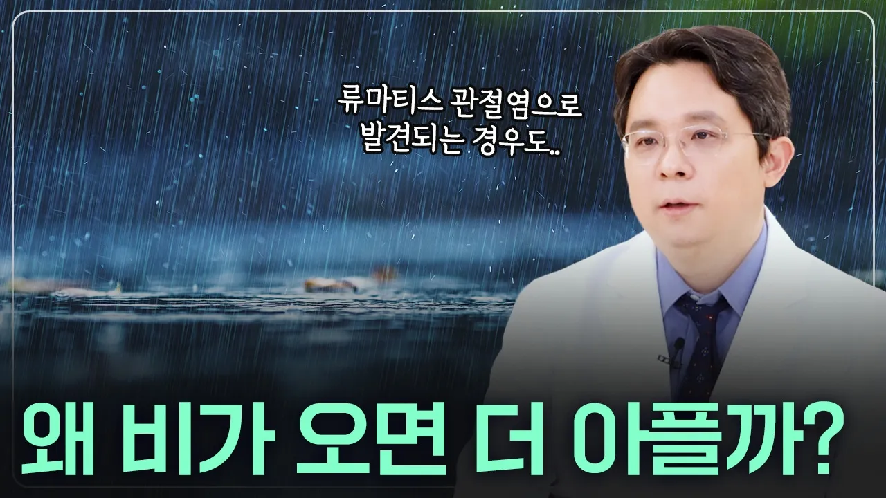

# 손가락 및 관절 통증 비 오는 날 왜 더 아플까? #손가락마디통증 #류마티스내과 #손마디통증

## 기본 정보
- **URL**: https://www.youtube.com/watch?v=z9BDa6P4Bi4
- **채널명**: RheumaTV – ASANBONE Rheumatology Clinic
- **구독자수**: 6만
- **조회수**: 12,125
- **업로드일**: 2026-04-29
- **영상 길이**: 3:46
- **댓글 수**: 1
- **좋아요 수**: 8

## 썸네일

---

## 댓글 (추천순 TOP 10)

| 순위 | 좋아요 | 댓글 |
|------|--------|------|
| 1 | 0 | 🦴 아산본 관절·류마티스·통증센터
 🦴 아산본내과 아산본한의원
 🦴 관절류마티스분과전문의(내과전문의), 한의사 동시면허
 🔹 02-488-0075
 
 🔹 네이버 진료예약 https://booking.naver.com/booking/13/bizes/433423
 🔹 아산본 홈페이지 https://www.asanbone.com
 🔹 아산본 위치안내 https://naver.me/5huahv8T
 🔹 관절한약 류마스틱 https://www.asanbone.com/ck_Sub/Menu_6.php?hCode=subMenu_6_2_new
 
 Joint Rheumatism Subspecialist (Internal Medicine Specialist), Dual Licensed as Korean Medicine Doctor |
