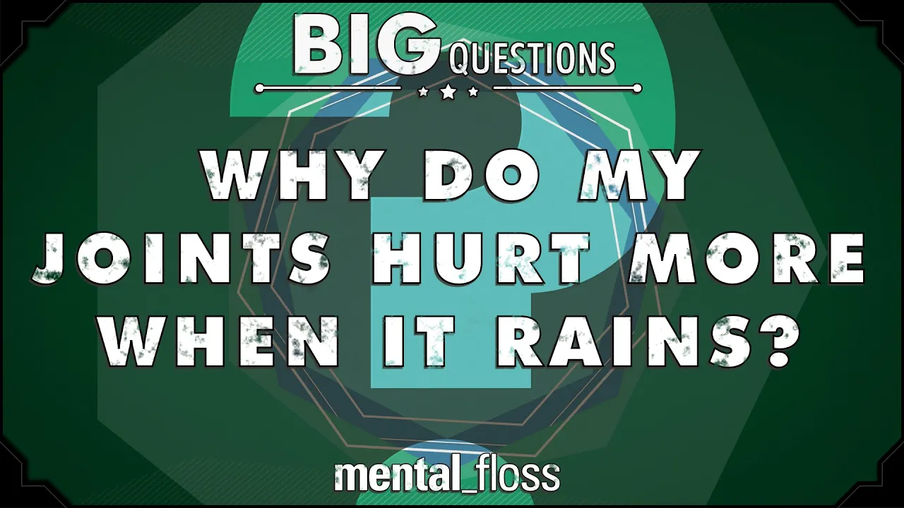

# Why do my joints hurt more when it rains?  - Big Questions - (Ep. 203) | Mental Floss

## 기본 정보
- **URL**: https://www.youtube.com/watch?v=UdN0RJBmeRQ
- **채널명**: Mental Floss
- **구독자수**: 131만
- **조회수**: 132,237
- **업로드일**: 2015-09-21
- **영상 길이**: 2:27
- **댓글 수**: 248
- **좋아요 수**: 2,571

## 썸네일

---

## 댓글 (추천순 TOP 10)

| 순위 | 좋아요 | 댓글 |
|------|--------|------|
| 1 | 135 | if your joints hurt, then you need to roll them smaller. |
| 2 | 1 | This made my day. lmao. |
| 3 | 0 | And looser, maybe throw in a filter to loosen things up a CH. |
| 4 | 0 | Pootersmasher equivalent of an ant leg which is the metric conversion ;) |
| 5 | 0 | +Hiway and not to be confused with a redheaded ch, a bit thinner. |
| 6 | 0 | Hiway rofl, nice one. |
| 7 | 0 | 😂😂 |
| 8 | 25 | There's also a correlation between changes in barometric pressure & migraines. Makes it fun when your doctor asks if you're avoiding your triggers... Riiiight. I can totally control the weather. -maggie. |
| 9 | 0 | Exactly. I love the fact that there's definitely a connection but yet scientists cant figure out why. Only God can give us answers to true questions. |
| 10 | 10 | is that why old people say i can feel rain coming with my knees? |
