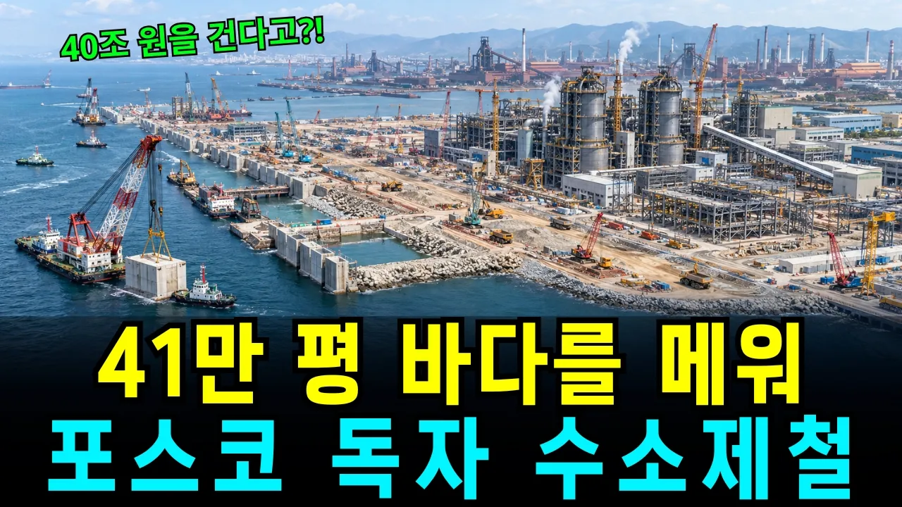

# "유럽 기술 베끼지 않았습니다" 포스코가 41만 평 바다를 메워 만든 기적의 진짜 이유

## 기본 정보
- **URL**: https://www.youtube.com/watch?v=bxVTPD3ZZf8
- **채널명**: 판이 바뀐다
- **구독자수**: 2,440
- **조회수**: 89,148
- **업로드일**: 2026-09-26
- **영상 길이**: 26:02
- **댓글 수**: 133
- **좋아요 수**: 994

## 썸네일

---

## 댓글 (추천순 TOP 10)

| 순위 | 좋아요 | 댓글 |
|------|--------|------|
| 1 | 37 | 누가 뭐래도 이 기적은 모두 앞날을 볼수 있는 혜안을 가지신  위대한 지도자 박정희대통령 각하와 박태준 회장님이 계셨기 때문이다. 언젠가는 광화문에 박정희 대통령님의 동상이 세워지기를 기원합니다. |
| 2 | 5 | 포항제철 건설 과정에서 당시의 국가적 추진력과 박태준 회장의 역할이 컸던 것은 분명 중요한 역사입니다. 그때 시작된 철강 산업의 도전이 앞으로 어떤 모습으로 이어질지도 지켜볼 만한 것 같습니다. |
| 3 | 2 | 100% 동감! 박정희 대통령 동상이 꼭 이루어지길 기원합니다!!!🎉 |
| 4 | 2 | 박정희의 묘는 국립묘지에서 파묘되어야 한다. 그는 국립묘지에 묻힐 자격이 없다. |
| 5 | 3 | 역사적 인물에 대한 평가는 서로 다를 수 있다고 생각합니다. 이번 영상에서는 정치적 평가보다는 포항제철의 산업적 의미와 앞으로의 철강 산업 변화에 초점을 맞췄습니다. |
| 6 | 0 |  @jxisml  사람은 누구나 장점과 단점이 있기 마련입니다.  정치질에 눈이 멀어 과거 위인의 업적을 똥으로 안다면, 당신 머리에 똥만 들어있다는 겁니다. 그의 업적을 생각해 본적은 있습니까?  박정희대통령 업적
 • 경제 개발 5개년 계획 추진 → ‘한강의 기적’ 달성
 • 경부고속도로 건설 등 국가 인프라 확충
 • 중화학 공업 육성으로 산업구조 고도화
 • 통일벼 보급 등 농업 생산성 향상-국민의 배고품해결
 • 한일 국교 정상화 및 외교 기반 확립
 • 베트남 파병을 통한 경제·군사 지원 확보 그가 없었다면, 지금의 대한민국도 존재하지 못했을 것입니다. |
| 7 | 13 | 우리 경제에 긍정적인 영향을 미쳤으면 좋겠어요! 포스코 응원합니다! |
| 8 | 12 | 포스코가 이렇게 큰 도전을 하다니, 정말 자랑스러워요! |
| 9 | 13 | 영일만의 기적이 다시 시작된다니, 흥분됩니다! |
| 10 | 7 | 50년 만의 퇴출 위기라니... 정말 큰 도전이네요. |
