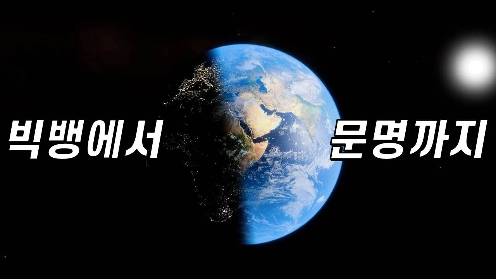

# [138억 년 연대기] 우주의 탄생부터 인류 문명에 이르기까지!

## 기본 정보
- **URL**: https://www.youtube.com/watch?v=SpwjnllzL3o
- **채널명**: 과학드림 [Science Dream]
- **구독자수**: 115만
- **조회수**: 1,431,891
- **업로드일**: 2021-11-12
- **영상 길이**: 10:35
- **댓글 수**: 1,200
- **좋아요 수**: 14,224

## 썸네일

---

## 댓글 (추천순 TOP 10)

| 순위 | 좋아요 | 댓글 |
|------|--------|------|
| 1 | 910 | 근데 진짜 마지막 말 "과학은 세상을 보는 창" 진짜 잘 정하신거 같아요ㅜㅜ |
| 2 | 326 | 예전 기자 시절 때 서강대 이덕환 교수님께서 해주신 말씀인데, 뇌리에 박혀 이렇게 채널 문구로 사용하게 됐습니다~!저도 참 좋은 말이라고 생각해요! |
| 3 | 3 | 여기선 책 이야기는 안나오는군요   한국어 버전이 오리지날인가봅니다. 클로징 멘트는 한국과 일본이 동일하네요.   https://youtu.be/Pg7lBG8Cz7Y |
| 4 | 46 | ㅇㅈ끝날때쯤 따라하게됨 |
| 5 | 10 |  @수헬리베붕탄소년단  죄송하진 않은데 사실 좀 없어보임 |
| 6 | 6 |  @얍-u3b  좀비고충 잼민이 |
| 7 | 0 | ​ @얍-u3b 라고 하는게 더 없어보이는건 모르는구나 |
| 8 | 2 | 형이 왜 거기에.... 저 09젤린이예요 |
| 9 | 1 | 고등학생땐가 같은반이었던 애가 과학=자연 이라고 우겨서 설득하기를 포기했었는데 참 ... 보여주고싶네ㅋㅋ |
| 10 | 1 | 근데 왜 울어요 ㅋㅋㅋㅋ |
