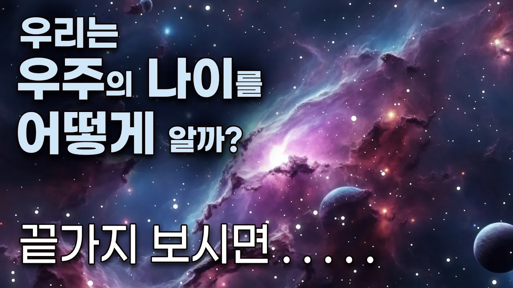

# 138억 년… 정말 맞는 숫자일까

## 기본 정보
- **URL**: https://www.youtube.com/watch?v=qGKSZoFRhT0
- **채널명**: MrSpace
- **구독자수**: 33만
- **조회수**: 26,401
- **업로드일**: 2026-04-09
- **영상 길이**: 13:26
- **댓글 수**: 88
- **좋아요 수**: 828

## 썸네일

---

## 댓글 (추천순 TOP 10)

| 순위 | 좋아요 | 댓글 |
|------|--------|------|
| 1 | 9 | 유튜브 알고리즘에 허구한 날 전쟁 관련된 뉴스로 도배돼서 스트레스 심한데 우주아저씨 때문에 힐링되고 마음이 평온, 편안해집니다. 항상 보고 듣고 느끼고 힐링하고 있습니다 |
| 2 | 11 | 노래 삽입..  신의한수..너무좋아요 |
| 3 | 7 | 아 우주아저씨 목소리 들은지 3분만에 벌써 졸리워요. |
| 4 | 10 | 와 노래 진짜 좋아요 계속 듣게 됩니다 노래만 따로 영상 올려주시면 좋을 것 같아요^^ |
| 5 | 6 | 와 목소리 소름~~ 우주 유튜브 위에 태어난 우주아저씨   와 소름~~ |
| 6 | 7 | 아저씨 목소리와 말투는 독보적. 최고의 수면영상 |
| 7 | 6 | 오늘도 잠자리에서 듣고 있네요. 꾸벅 |
| 8 | 3 | 목요일에 듣는 우주아저씨의 우주이야기 오늘은 우주의 나이 내나이는    그냥 부끄럽네요 숙연해지네 감사하며 잠에 들어야겠네요.아르테메스2호로 달 뒷면의 수수께끼가 풀리길 바라며 우주에서 촬영한 지구의 모습은 우주 창조가 이런거다 싶었어요 지구로의 무사귀환을 바랍니다. |
| 9 | 3 | 후반부 음원 정말 좋네요. 우주 아저씨 목소리 기반으로 AI 만드셨다고 하셨는데 실제 가수가 불렀다 해도 믿을거 같아요. 유튜브에 음원 등록하셔도 될거 같아요~ 제발 해주세용^^ |
| 10 | 3 | 아 방금 일어났는데 다시 잠들겠네... |
