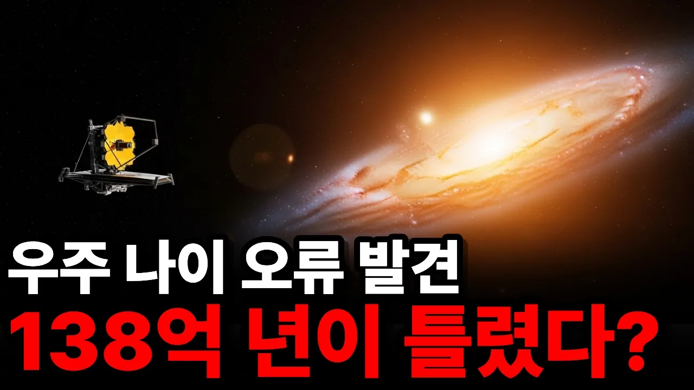

# 우주 나이 138억 년이 틀렸다고? 제임스 웹이 찍은 사진 한 장의 파문

## 기본 정보
- **URL**: https://www.youtube.com/watch?v=-WJfTAPoQEs
- **채널명**: 우주생각
- **구독자수**: 3,920
- **조회수**: 12,297
- **업로드일**: 2026-02-20
- **영상 길이**: 16:31
- **댓글 수**: 81
- **좋아요 수**: 232

## 썸네일

---

## 댓글 (추천순 TOP 10)

| 순위 | 좋아요 | 댓글 |
|------|--------|------|
| 1 | 1 | 우주나이가 지구나이의 3배라는게 그게 더 말이 안되는거다. 거기에 억지로 끼워 맞추니깐 은하가 더 빨리 만들어 진다는 얘기를 하는거다. |
| 2 | 3 | 적색편이를 우주의 팽창에만 의지하려는 현 과학이 조금 단편적이다.  시공간은 중력에 따라 천천히 흐른다는것을 일반상대성이론에서 찾았는데, 우주를 우리지구중력시간으로 138억년이라 계산한 것이 실제 우주가 지나온 시간은 아니라는 말이된다. 시간은 가변함수일 뿐이다. 지구에서 본 우주의 빅뱅이 138억년 전에 있었다 하더라도 시간이 거의 흐르지 않는 블랙홀에서 우주배경복사를 보면 1만년의 우주 시공간이 될 수도 있다는 말이다. 시간은 일정하게 흐르지 않는다는 아인슈타인의 상대성이론을 잘 알면서도 우주의 시간을 138억년이라 정한 부작의는 전혀 과학적이지 않아 보인다. |
| 3 | 9 | 애초에 인간이 우주를 논하는것 자체가 말이 안됨.. |
| 4 | 0 | 말 도ㅐ |
| 5 | 9 | 나도 전문가는 아니지만 우주론 중에 가장 믿을 수 없는 것이 우주나이 138억년 이라는 것 |
| 6 | 1 | 나이 138억년살이라고 불리는 우주 또는 우리가 흔히 말하는 우주는 기본적으로 관측가능한우주란 뜻임 |
| 7 | 1 | 전문가 아닌거 티남. 138억년이 우주의 나이지 만약 우리가 빅뱅부터 관찰 했다면 우리시간으로 수천억년임. |
| 8 | 2 | 그니까 빅뱅이론이 하나의 이론인것이지, 정확한것이 아님, 억지로 끼워마추는 인간생각의 한계임 |
| 9 | 3 | 이런 과정을 겪으면서 진실에 가까워지는거지 뭐. 지금 과학이 가지고 있는 전제는, "지금 과학적 결론은 진실이 아니다. 다만 현상을 가장 잘 설명한다"  아닌가? 그렇게 가다보면 진실에 한발 더  가깝게 가는거지. 우리 인간이 멸망 할 때까지. |
| 10 | 0 | 맞지 초기화 과학적한계..반복 |
