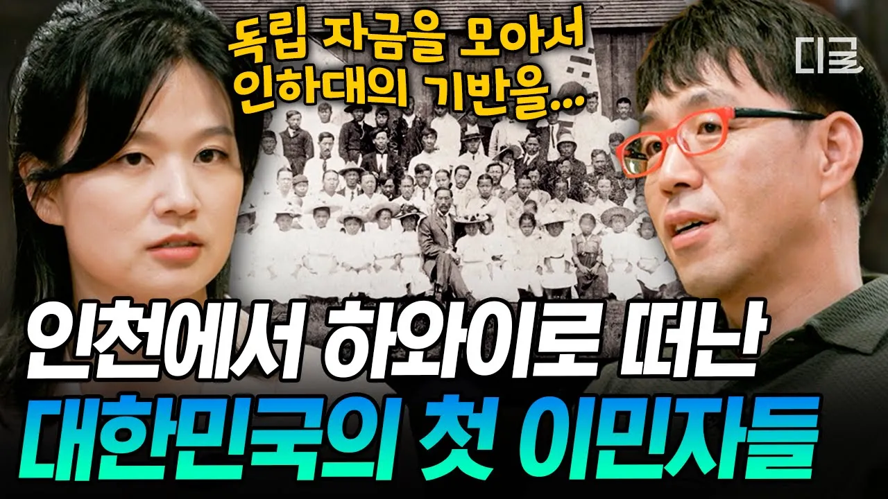

# [#알쓸별잡] '인하대학교' 이름의 비밀❓조국을 잊지 않은 하와이 한인들이 먼 타국에서 독립운동을 한 방법💥

## 기본 정보
- **URL**: https://www.youtube.com/watch?v=q479TvSaziA
- **채널명**: 디글 :Diggle
- **구독자수**: 431만
- **조회수**: 2,737
- **업로드일**: 2026-04-04
- **영상 길이**: 17:23
- **댓글 수**: 2
- **좋아요 수**: 32

## 썸네일

---

## 댓글 (추천순 TOP 10)

| 순위 | 좋아요 | 댓글 |
|------|--------|------|
| 1 | 12 | 인하공전이 아니라 인하공대 |
| 2 | 1 | 송금 담당중에 이승만이가 있었다. 그는 피땀으로 만든 독립운동자금을 쌔벼서 여자꼬시는데 썼다.. 그 자는 제대로 독립자금을 임정에 제대로 가져다 준 적이 없었다.. 대한민국의 일부는 그 자를 국부라고부른다.. |
