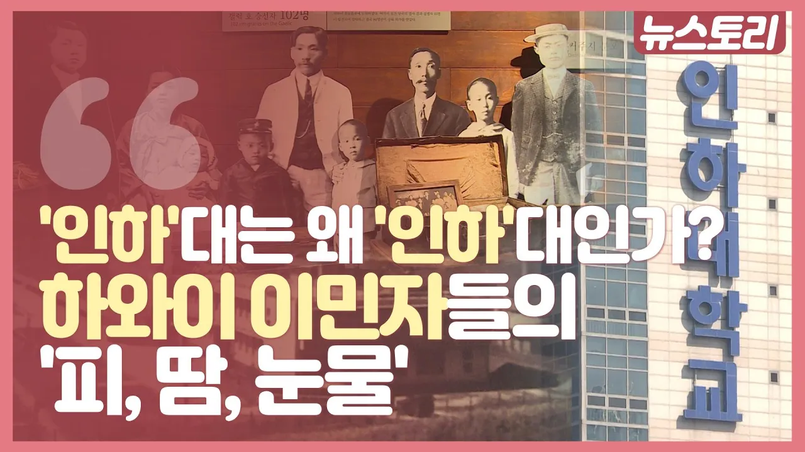

# '인하'대는 왜 '인하'대일까? 인하대학교에 숨겨진 피, 땀, 눈물!

## 기본 정보
- **URL**: https://www.youtube.com/watch?v=G27gHm0csFU
- **채널명**: LG헬로비전 서울경인
- **구독자수**: 2만
- **조회수**: 8,565
- **업로드일**: 2019-11-28
- **영상 길이**: 2:59
- **댓글 수**: 10
- **좋아요 수**: 79

## 썸네일

---

## 댓글 (추천순 TOP 10)

| 순위 | 좋아요 | 댓글 |
|------|--------|------|
| 1 | 6 | 이승만대통령 이야기를 빼고 설명하네요. |
| 2 | 15 | 하와이 이민자들이 나라의 독립을 위해서  사탕수수농장에서   노예처럼 피땀흘려 번돈을  독립군 자금을 모아  헌납하듯이    나라의 번영을 위해서  미국 MIT같은  인천에   인하공대를  세운  그 애국심을   인천 시민들은 잊어선 안된다 |
| 3 | 4 | 하와이 동포분들 정말 감사합니다 |
| 4 | 1 | 이승만대통령님 건국대통령님 자유민주주의 감사합니다 🎉🎉🎉🎉 |
| 5 | 6 | 이승만의 교육사업이 성공해서 하와이에서 꽃을 피우다.. |
| 6 | 3 | 부실 3~4등급대학아닌가.. |
| 7 | 7 | ㅋㅋㅋㅋ뒤질라곸ㅋ |
| 8 | 6 | 아무리못해도 2등급 중반은되야 막차로 붙는데 ㅋㅋㅋㅋㅋㅋ |
| 9 | 5 | 인하대 문과도  2.5등급되야 안정권임 2022기준 올해 수험생임  일반고기준 |
| 10 | 3 | 그 부실대로 선정된 이유가 교육부 맘대로라는것은 아는지? |
